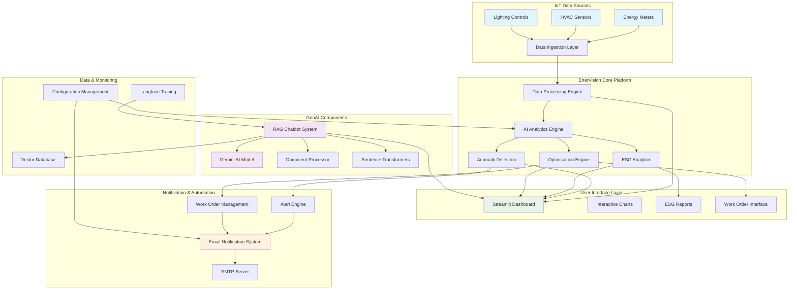

# EnerVision: Smart Branch Energy Management & ESG Optimization Platform

[](https://python.org)
[](https://streamlit.io)
[](LICENSE)

## 🌟 Overview

**EnerVision** is an AI-powered Smart Branch Energy Management Platform that combines IoT data analytics, GenAI capabilities, and ESG (Environmental, Social, Governance) reporting to optimize energy consumption across multiple branch locations. The platform provides real-time monitoring, anomaly detection, predictive analytics, and automated work order management to help organizations achieve their sustainability goals.

## 🎯 Key Features

### 🔋 Energy Management & IoT Integration
- **Real-time IoT Data Processing**: Integration with energy meters, HVAC sensors, and lighting controls
- **Energy Consumption Analytics**: Advanced trend analysis and pattern recognition
- **Anomaly Detection**: AI-powered identification of unusual energy consumption patterns
- **Predictive Maintenance**: Proactive equipment monitoring and maintenance scheduling

### 🤖 GenAI-Powered Intelligence  
- **RAG Chatbot**: Policy document querying with Retrieval Augmented Generation
- **ESG Report Generation**: Automated sustainability reporting and recommendations
- **Optimization Recommendations**: AI-generated actionable insights for energy reduction
- **Natural Language Processing**: Document analysis and intelligent responses

### 📊 Dashboard & Visualization
- **Interactive Streamlit Dashboard**: Real-time energy consumption visualization
- **Plotly Charts**: Dynamic graphs and performance indicators
- **Multi-branch Monitoring**: Centralized view of all branch locations
- **ESG Metrics Tracking**: Comprehensive sustainability KPI dashboard

### ⚡ Automation & Notifications
- **Work Order Management**: Automated generation and tracking of maintenance tasks
- **Email Notifications**: Smart alerts for anomalies, work orders, and reports
- **Priority-based Alerts**: Intelligent classification of issues by severity
- **SMTP Integration**: Secure email delivery with template support

## 🏗️ System Architecture



## 🚀 Quick Start

### Prerequisites

- Python 3.8 or higher
- pip package manager
- Git

### Installation

1. **Clone the repository**
```bash
git clone https://github.com/sharaneeshvar/EnerVision_Agentic_AI_Driven_Smart_Branch_Energy_Optimization.git
cd enervision-platform
```

2. **Create virtual environment**
```bash
python -m venv venv
source venv/bin/activate  # On Windows: venv\Scripts\activate
```

3. **Install dependencies**
```bash
pip install -r requirements.txt
```

4. **Environment Configuration**
Create a `.env` file in the root directory:
```env
# Gemini AI Configuration
GEMINI_API_KEY=your_gemini_api_key_here

# SMTP Configuration
SMTP_HOST=smtp.gmail.com
SMTP_PORT=587
SMTP_USERNAME=your_email@gmail.com
SMTP_PASSWORD=your_app_password

# Langfuse Configuration (Optional)
LANGFUSE_SECRET_KEY=your_secret_key
LANGFUSE_PUBLIC_KEY=your_public_key
LANGFUSE_HOST=https://cloud.langfuse.com
```

5. **Run the application**
```bash
# Main notification system
streamlit run main.py

# RAG Chatbot interface
streamlit run rag_chatbot_app.py
```

## 📋 Dependencies

### Core Libraries
```
streamlit>=1.28.0
pandas>=1.5.0
numpy>=1.21.0
plotly>=5.0.0
```

### AI & ML Libraries
```
google-generativeai>=0.3.0
sentence-transformers>=2.2.0
scikit-learn>=1.0.0
langfuse>=2.0.0
```

### Document Processing
```
PyPDF2>=3.0.0
python-docx>=0.8.11
```

### Additional Libraries
```
python-dotenv>=0.19.0
smtplib-ssl>=1.0.0
ssl-utils>=1.0.0
```

## 🔧 Configuration

### 1. API Keys Setup

#### Gemini AI API Key
1. Visit [Google AI Studio](https://makersuite.google.com/app/apikey)
2. Create a new API key
3. Add it to your `.env` file

#### Langfuse Configuration (Optional)
1. Create account at [Langfuse Cloud](https://cloud.langfuse.com)
2. Create a new project
3. Copy your secret and public keys
4. Add project ID for trace links

### 2. SMTP Configuration
For email notifications, configure your SMTP settings:
- **Gmail**: Use App Password (not regular password)
- **Outlook**: Use standard credentials
- **Custom SMTP**: Configure host and port accordingly

### 3. Document Upload
The RAG chatbot supports:
- **PDF files**: Policy documents, manuals
- **DOCX files**: Word documents
- **TXT files**: Plain text documents

## 💡 Usage Examples

### Energy Anomaly Detection
```python
# Example anomaly data structure
anomaly_data = {
    'Type': 'High Energy Consumption',
    'Branch': 'Downtown Office',
    'Date': '2024-03-15',
    'Value': 2500,  # kWh
    'Expected': 1800,  # kWh
    'Deviation': 3.2,  # standard deviations
    'Severity': 'High'
}

# Send anomaly alert
notification_system.send_anomaly_alert([anomaly_data], "manager@company.com")
```

### Work Order Creation
```python
# Example work order
work_order = {
    'id': 'WO-2024-001',
    'title': 'HVAC System Maintenance',
    'priority': 'High',
    'branch': 'Main Office',
    'category': 'Equipment Maintenance',
    'due_date': '2024-03-20',
    'estimated_hours': 4,
    'cost_estimate': 1500,
    'status': 'Open',
    'created_date': '2024-03-15',
    'description': 'HVAC system showing irregular energy patterns'
}

# Send work order notification
notification_system.send_work_order_notification(work_order, "technician@company.com")
```

### RAG Chatbot Queries
```python
# Example queries for policy documents
queries = [
    "What is the company's ESG policy?",
    "How do we calculate carbon emissions?",
    "What are the energy efficiency targets?",
    "Explain the sustainability reporting process"
]
```

## 📊 Features Deep Dive

### 1. IoT Data Integration
- **Real-time Processing**: Continuous monitoring of energy consumption
- **Multi-sensor Support**: Integration with various IoT devices
- **Data Validation**: Automatic data quality checks and cleaning

### 2. AI-Powered Analytics
- **Trend Analysis**: Historical pattern recognition and forecasting
- **Anomaly Detection**: Machine learning-based outlier identification
- **Optimization Recommendations**: AI-generated energy saving suggestions

### 3. ESG Reporting
- **Automated Reports**: Scheduled ESG performance reports
- **Compliance Tracking**: Monitor adherence to sustainability standards
- **Carbon Footprint Calculation**: Real-time emissions tracking

### 4. Work Order Management
- **Automated Creation**: AI-triggered maintenance requests
- **Priority Classification**: Intelligent urgency assessment
- **Progress Tracking**: Real-time status updates

## 🔍 Monitoring & Observability

### Langfuse Integration
- **Trace Monitoring**: Complete request tracing for AI operations
- **Performance Analytics**: Response time and accuracy metrics
- **Debug Information**: Detailed logging for troubleshooting

### Dashboard Analytics
- **Real-time Metrics**: Live energy consumption data
- **Historical Trends**: Long-term pattern analysis
- **Performance KPIs**: Key sustainability indicators

## 🛠️ Development

### Project Structure
```
enervision-platform/
│
├── main.py                 # Main notification system
├── rag_chatbot_app.py      # RAG chatbot interface
├── config.py               # Configuration management
├── requirements.txt        # Python dependencies
├── .env                    # Environment variables
├── README.md               # This file
│
├── templates/              # Email templates
│   ├── work_order.html
│   ├── anomaly_alert.html
│   └── energy_report.html
│
├── static/                 # Static assets
│   ├── css/
│   ├── js/
│   └── images/
│
├── data/                   # Data storage
│   ├── documents/          # Policy documents
│   └── exports/            # Generated reports
│
└── tests/                  # Unit tests
    ├── test_notifications.py
    ├── test_rag_system.py
    └── test_analytics.py
```

### Contributing
1. Fork the repository
2. Create a feature branch (`git checkout -b feature/new-feature`)
3. Commit your changes (`git commit -am 'Add new feature'`)
4. Push to the branch (`git push origin feature/new-feature`)
5. Create a Pull Request

## 🔒 Security & Privacy

- **Environment Variables**: Secure storage of API keys and credentials
- **SMTP Authentication**: Encrypted email communication
- **Data Encryption**: Secure handling of sensitive information
- **Access Control**: Role-based permissions for different users

## 📈 Performance Optimization

### Caching Strategies
- **Model Caching**: Streamlit cache for AI models
- **Embedding Cache**: Efficient vector storage and retrieval
- **Session State**: Optimized state management

### Scalability Features
- **Batch Processing**: Efficient handling of large datasets
- **Async Operations**: Non-blocking email and API calls
- **Memory Management**: Optimized resource utilization

## 🚨 Troubleshooting

### Common Issues

#### 1. API Key Problems
```bash
# Test Gemini API key
python -c "import google.generativeai as genai; genai.configure(api_key='YOUR_KEY'); print('API key valid!')"
```

#### 2. SMTP Configuration
- Use App Password for Gmail (not regular password)
- Check firewall settings for SMTP ports (587, 465)
- Verify SMTP host and port configuration

#### 3. Document Processing Errors
- Ensure document formats are supported (PDF, DOCX, TXT)
- Check file permissions and accessibility
- Verify document encoding (UTF-8 recommended)

#### 4. Langfuse Connection Issues
- Verify secret and public keys
- Check project ID configuration
- Ensure network connectivity to Langfuse cloud

## 🎯 Roadmap & Future Enhancements

### Planned Features
- [ ] **Multi-tenant Architecture**: Support for multiple organizations
- [ ] **Advanced IoT Integration**: Expanded sensor support and protocols
- [ ] **Machine Learning Models**: Custom energy prediction models
- [ ] **Mobile Application**: iOS and Android companion apps
- [ ] **API Gateway**: RESTful API for third-party integrations
- [ ] **Blockchain Integration**: Carbon credit tracking and trading

### Version History
- **v1.0.0**: Initial release with core energy management features
- **v1.1.0**: Added RAG chatbot and document processing
- **v1.2.0**: Enhanced notification system and work order management
- **v1.3.0**: Langfuse integration and improved observability

## Video Link
https://drive.google.com/file/d/1SpqM0nVZdy54lsTloOT-7_mFEs5ZQNNV/view?usp=sharing

## 🤝 Support & Community

### Getting Help
- **GitHub Issues**: Report bugs and request features
- **Documentation**: Comprehensive guides and API references
- **Community Forum**: Connect with other users and developers

## 🙏 Acknowledgments

- **Google Gemini AI**: Powering our GenAI capabilities
- **Streamlit Team**: Excellent framework for ML applications
- **Langfuse**: Outstanding observability and tracing platform
- **Open Source Community**: Various libraries and tools that make this project possible

---

**EnerVision** - Empowering sustainable energy management through AI and IoT innovation! 🌱⚡
