# 🚀 Network TroubleShooter AI
### *Intelligent Network Issue Resolution with Dual-Agent Architecture*

<div align="center">

[](https://www.python.org/)
[](https://fastapi.tiangolo.com/)
[](https://streamlit.io/)
[](https://cloud.google.com/)
[](https://www.trychroma.com/)
[](LICENSE)

**Reduce Mean Time To Resolution (MTTR) from hours to minutes**

[🎯 Features](#-key-features) • [🏗️ Architecture](#️-system-architecture) • [🚀 Quick Start](#-quick-start) • [📡 API Reference](#-api-reference) • [🖥️ Web Interface](#️-web-interface) • [📊 Performance](#-performance-metrics)

</div>

---

## 🎯 Key Features

<table>
<tr>
<td width="50%">

### 🤖 **Intelligent Dual-Agent System**
- **Agent 1**: Lightning-fast AutoGen retriever for common issues
- **Agent 2**: Advanced LangGraph reasoner for complex scenarios
- **Smart Escalation**: Automatic handoff based on confidence thresholds

### 📡 **RESTful API Backend**
- **FastAPI**: High-performance async API server
- **GeminiAPI**: Auto-generated documentation and client SDKs


</td>
<td width="50%">

### ⚡ **Performance Optimized**
- Sub-second response times for 80% of incidents
- 95% accuracy on historical problem patterns
- Automatic SLA monitoring and breach alerts

### 🎨 **Interactive Web Interface**
- **Streamlit**: Real-time troubleshooting dashboard
- Visual network topology integration
- Collaborative incident management

</td>
</tr>
<tr>
<td width="50%">

### 🧠 **Vector-Powered Knowledge Base**
- Chroma vector database for semantic search
- Historical incident patterns and solutions
- Technical documentation integration

</td>
<td width="50%">

### 🔗 **Multi-Interface Access**
- **Web UI**: User-friendly Streamlit interface
- **REST API**: Programmatic access for integrations
- **ML Flow**: Real-time updates and notifications

</td>
</tr>
</table>

---

## 🏗️ System Architecture

```mermaid
graph TB
    subgraph "🌐 User Interfaces"
        A[Streamlit Web App]
        B[Mobile Dashboard]
        C[Service Desk Portal]
        D[External Integrations]
    end
    
    subgraph "⚡ API Gateway Layer"
        E[FastAPI Server]
        F[Authentication & CORS]
        G[Rate Limiting]
        H[Request Validation]
    end
    
    subgraph "🎨 Frontend Layer"
        I[Streamlit Server]
        J[Session State Manager]
        K[Real-time Updates]
    end
    
    subgraph "🤖 AI Agent Layer"
        L[Agent Orchestrator]
        M[AutoGen Retriever<br/>📊 Confidence ≥ 0.75]
        N[LangGraph Reasoner<br/>🧠 Complex Analysis]
    end
    
    subgraph "💾 Knowledge Infrastructure"
        O[(Chroma Vector DB)]
        P[(Historical Incidents)]
        Q[(Technical Docs)]
        R[(Solution Templates)]
    end
    
    subgraph "📊 Monitoring & Analytics"
        S[Cloud Monitoring]
        T[Performance Metrics]
        U[SLA Dashboard]
    end
    
    A --> E
    B --> E
    C --> E
    D --> E
    A --> I
    E --> F
    F --> G
    G --> H
    E --> L
    I --> E
    I --> J
    I --> K
    L --> M
    L --> N
    M -.-> N
    M --> O
    N --> O
    O --> P
    O --> Q
    O --> R
    L --> S
    S --> T
    S --> U
    
    classDef primary fill:#FF4B4B,stroke:#FF2B2B,stroke-width:2px,color:#fff
    classDef secondary fill:#34A853,stroke:#137333,stroke-width:2px,color:#fff
    classDef accent fill:#8B5CF6,stroke:#7C3AED,stroke-width:2px,color:#fff
    classDef api fill:#009688,stroke:#00695C,stroke-width:2px,color:#fff
    
    class I,J,K primary
    class E,F,G,H api
    class M,N secondary
    class O,P,Q,R accent
```



### 🎯 **Intelligent Routing Logic**

| **Confidence Score** | **Action** | **API Endpoint** | **Expected Resolution Time** |
|---------------------|------------|------------------|-------------------------------|
| `≥ 0.75` | 🎯 Direct solution from Agent 1 | `POST /incidents/analyze` | `< 500ms` |
| `0.50 - 0.74` | 🔄 Escalate to Agent 2 + validation | `POST /incidents/escalate` | `< 2s` |
| `< 0.50` | 🚨 Human expert notification | `POST /incidents/escalate` | `< 5min SLA` |

---

## 🛠️ Technology Stack

<div align="center">

| **Layer** | **Technology** | **Purpose** |
|-----------|----------------|-------------|
| 🎨 **Frontend** | Streamlit, Plotly | Interactive web interface |
| 📡 **API Server** | FastAPI, Uvicorn | High-performance REST API |
| 🤖 **AI/ML** | Vertex AI, Retriver, LangGraph | Intelligent problem analysis |
| 💾 **Database** | Chroma Vector DB | Knowledge storage & analytics |
| 🏗️ **Infrastructure** | GCP (GKE, GCS, Cloud Run) | Scalable cloud architecture |
| 🔐 **Security** | IAM | Enterprise-grade protection |
| 📊 **Monitoring** | Cloud Monitoring| Real-time observability |

</div>

---

## 🚀 Quick Start

### Prerequisites
- Google Cloud Project with billing enabled
- Python 3.9+ installed


### 1️⃣ **Environment Setup**

```bash
# Clone the repository
git clone https://github.com/your-org/network-troubleshooter-ai.git
cd network-troubleshooter-ai

# Set up environment
cp .env.example .env
pip install -r requirements.txt

# Configure GCP authentication
gcloud auth application-default login
gcloud config set project YOUR_PROJECT_ID
```

### 2️⃣ **Deploy Infrastructure**

```bash

# Verify Chroma is running
curl -X GET "http://localhost:8000/api/v1/heartbeat"

# Start FastAPI Server (Port 8000)
uvicorn api.main:app --host 0.0.0.0 --port 8000 --reload

# Start Streamlit Application (Port 8501)
streamlit run app.py --server.port 8501 --server.address 0.0.0.0

# Deploy AutoGen Retriever (Agent 1)
gcloud functions deploy network-agent-retriever \
  --runtime python39 \
  --trigger-http \
  --region us-central1 \
  --memory 2Gi \
  --timeout 60s

# Deploy LangGraph Reasoner (Agent 2)
gcloud run deploy langgraph-reasoner \
  --source infrastructure/langgraph-reasoner/ \
  --region us-central1 \
  --allow-unauthenticated
```

### 3️⃣ **Verify Services**

```bash
# Check FastAPI server
curl -X GET "http://localhost:8000/health"

# Check Streamlit app
curl -X GET "http://localhost:8501/_stcore/health"

# Load sample knowledge base
python scripts/data_ingestion.py \
  --incidents data/historical_incidents.csv \
  --tech data/tech_templates.csv \
  --docs data/technical_documentation/

# Run networkcheck check
python scripts/network_check.py --verify-all-services
```

---

## 📡 API Reference

### 🔗 **Base URLs**
- **FastAPI Server**: `http://localhost:8000` (Production: `https://api.your-domain.com`)
- **Streamlit App**: `http://localhost:8501` (Production: `https://app.your-domain.com`)

### 🎯 **Core Endpoints**

#### **Incident Analysis**
```bash
# Analyze network incident
POST /api/v1/incidents/analyze
Content-Type: application/json
Authorization: Bearer <token>

{
  "description": "Router RTR-DC01-001 experiencing packet drops during peak hours",
  "severity": "High",
  "location": "DC-01",
  "priority": "P1",
  "tags": ["routing", "performance", "datacenter"]
}

# Response
{
  "ticket_id": "INC-2024-001234",
  "status": "analyzed",
  "confidence_score": 0.87,
  "selected_agent": "autogen_retriever",
  "root_cause": "Interface congestion during traffic spikes",
  "solution_steps": [
    {
      "step": 1,
      "action": "Check interface utilization",
      "command": "show interface brief",
      "expected_outcome": "Identify congested interfaces"
    }
  ],
  "analysis_time": 0.34,
  "created_at": "2024-03-15T10:30:00Z"
}
```

#### **Knowledge Base Search**
```bash
# Search knowledge base
GET /api/v1/knowledge/search?q=packet%20drops&limit=5
Authorization: Bearer <token>

# Response
{
  "results": [
    {
      "id": "kb-001",
      "title": "Troubleshooting Packet Drops on Cisco Routers",
      "description": "Common causes and solutions for packet drops",
      "solution": "Step-by-step resolution guide...",
      "tags": ["cisco", "routing", "packet-drops"],
      "similarity_score": 0.95
    }
  ],
  "total": 23,
  "query_time": 0.12
}
```

---

## 🖥️ Web Interface (Streamlit)

### 🎯 **Main Dashboard Features**

<div align="center">

| **Feature** | **Description** | **API Integration** |
|-------------|-----------------|-------------------|
| 🔍 **Incident Input** | Natural language problem description | `POST /incidents/analyze` |
| 📊 **Real-time Analysis** | Live confidence scoring and agent selection | Streamlit `/ws/incidents/{id}` |
| 🛠️ **Solution Steps** | Interactive, step-by-step resolution guide | `GET /incidents/{id}/steps` |
| 📈 **Performance Metrics** | Live MTTR, resolution rates, SLA tracking | `GET /metrics/dashboard` |
| 🗂️ **Knowledge Explorer** | Search and browse historical solutions | `GET /knowledge/search` |
| 👥 **Collaboration Hub** | Multi-user incident management | `POST /incidents/{id}/collaborate` |

</div>

### 🎨 **Interface Screenshots**

<p align="center">
  
  
</p>


---

## 📁 Updated Project Structure

```
network-troubleshooter-ai/
├── 🎨 app.py                       # Main Streamlit, FastAPI, MlFlow application
├── 📡 api/
│   ├── main.py                     # FastAPI application entry point 
├── 🤖 agents/
│   ├── retriver_retriever/          # Agent 1: Fast pattern matching
│   └── fallback_reasoner/         # Agent 2: Complex reasoning
├── 💾 data/
│   ├── historical_incidents.csv    # Training incident data
│   ├── tech_templates.csv      # Proven resolution steps
│   └── technical_docs/             # Network documentation
├── 🏗️ infrastructure/
│   ├── chroma/                     # Vector DB deployment
│   ├── monitoring/                 # Observability stack
│   └── security/                   # IAM and secrets
├── 🧪 tests/
│   ├── api/                        # FastAPI endpoint tests
└── 📊 monitoring/
    ├── dashboards/                 # Metric dashboards
    └── alerts/                     # SLA monitoring rules
```

---

## 🚀 Deployment Options

### **Development Environment**
```bash
# Terminal 1: Start FastAPI server
uvicorn api.main:app --host 0.0.0.0 --port 8000 --reload

# Terminal 2: Start Streamlit app
streamlit run app.py --server.port 8501

### **Production Deployment (Docker Compose)**
```yaml

  streamlit:
    build: .
    command: streamlit run app.py --server.address 0.0.0.0 --server.port 8501
    ports:
      - "8501:8501"
    environment:
      - API_BASE_URL=http://fastapi:8000
    depends_on:
      - fastapi


  chroma:
    image: ghcr.io/chroma-core/chroma:latest
    ports:
      - "8000:8000"
    volumes:
      - chroma_data:/chroma/chroma

```

### **Cloud Deployment (Google Cloud)**
```bash
# Build and deploy FastAPI to Cloud Run
gcloud builds submit --tag gcr.io/$PROJECT_ID/network-api ./api
gcloud run deploy network-api \
  --image gcr.io/$PROJECT_ID/network-api \
  --platform managed \
  --region us-central1 \
  --port 8000 \
  --allow-unauthenticated

# Build and deploy Streamlit to Cloud Run
gcloud builds submit --tag gcr.io/$PROJECT_ID/network-ui .
gcloud run deploy network-ui \
  --image gcr.io/$PROJECT_ID/network-ui \
  --platform managed \
  --region us-central1 \
  --port 8501 \
  --set-env-vars API_BASE_URL=https://network-api-xxx.run.app
```

---

## 🔒 Security & Authentication

### **FastAPI Security Features**
- 🔐 **IAM Authentication**: Secure token-based authentication

---

## 🔧 Configuration

### **Environment Variables**
```bash

# Streamlit Configuration
export STREAMLIT_SERVER_PORT=8501
export API_BASE_URL="http://localhost:8000"
export ENABLE_REAL_TIME_UPDATES=true


# AI Services
export GCP_PROJECT_ID="your-project-id"
export CHROMA_HOST="localhost"
export CHROMA_PORT="8000"
export VERTEX_AI_REGION="us-central1"

# Performance
export MAX_CONCURRENT_REQUESTS=100
export REQUEST_TIMEOUT=30
export ENABLE_CACHING=true
```

---


### **Development Workflow**
1. 🍴 Fork the repository
2. 🌿 Create a feature branch (`git checkout -b feature/amazing-feature`)
3. 🧪 Test your changes:
   ```bash
   # Test FastAPI endpoints
   pytest tests/api/ -v
   
   # Test Streamlit components
   pytest tests/streamlit_tests/ -v
   
   # Integration tests
   pytest tests/integration/ -v
   ```
4. 💾 Commit your changes (`git commit -m 'Add amazing feature'`)
5. 📤 Push to the branch (`git push origin feature/amazing-feature`)
6. 🔄 Open a Pull Request

---

## 📄 License

This project is licensed under the MIT License - see the [LICENSE](LICENSE) file for details.

---

## 🙋‍♂️ Support & Community

<div align="center">

[](http://localhost:8000/docs)
[](http://localhost:8501)
[](http://localhost:5000)
[](https://docs.your-domain.com)
[](https://discord.gg/your-server)

**Built by the GenAI Team**
- [Ishika Saha] (https://github.com/Ixhika)
- [Yaswanth Merugumala] (https://github.com/yaswanthmerugumala)
- [Manjusha Merugu] (https://github.com/manjushamerugu)


*Featuring FastAPI for robust API services, Streamlit for intuitive user experience, and MLflow for comprehensive ML operations*

</div>

---

<div align="center">

### ⭐ **Star this repo if you find it helpful!** ⭐

*Transforming network operations with modern web technologies and AI.*

**🚀 FastAPI + 🎨 Streamlit + 🔬 MLflow = 💡 Intelligent Network Resolution**

---

## 📚 Additional Resources

### **🎓 Learning Resources**
- [FastAPI Best Practices](https://fastapi-best-practices.readthedocs.io/)
- [Streamlit Documentation](https://docs.streamlit.io/)
- [MLflow Tutorials](https://mlflow.org/docs/latest/tutorials-and-examples/index.html)
- [Network Troubleshooting with AI Guide](https://docs.your-domain.com/guides/ai-troubleshooting)

### **🔧 Development Tools**
- **MLFlow**: For tracing the performances.
- **Performance Profiling**: Use `streamlit run app.py --profiler` for UI optimization

### **📊 Monitoring Dashboards**
- **Metric Dashboard**: Import from `/monitoring/grafana/network-troubleshooter.json`
- **MLflow Experiments**: Access comparative model performance at `http://localhost:5000`
- **Application Metrics**: View real-time stats at `http://localhost:8000/metrics`
- **System Health**: Monitor infrastructure at `http://localhost:3000/d/system-overview`

### **🚀 Deployment Guides**
- [Production Deployment Guide](docs/deployment/production.md)
- [Kubernetes Deployment](docs/deployment/kubernetes.md)
- [CI/CD Pipeline Setup](docs/deployment/cicd.md)
- [Security Hardening Checklist](docs/security/checklist.md)

### **🤖 AI Model Development**
- [Custom Agent Development](docs/ai/custom-agents.md)
- [Training Data Preparation](docs/ai/data-preparation.md)
- [Model Evaluation Metrics](docs/ai/evaluation.md)
- [Hyperparameter Tuning Guide](docs/ai/hyperparameter-tuning.md)

</div>
