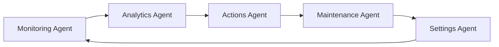

# ATM Multi-Agent Predictive Maintenance System


A comprehensive **Multi-Agent Predictive Maintenance System** for ATMs that leverages machine learning, IoT simulation, and intelligent agent coordination to predict failures, optimize maintenance schedules, and reduce downtime.

## 🚀 Features

### Core Capabilities
- **🤖 Multi-Agent Architecture**: Five specialized agents working in harmony
- **🔮 Predictive Analytics**: Random Forest ML model for failure prediction
- **📱 Mobile-First UI**: Responsive dark-themed dashboard
- **📊 Real-time Monitoring**: Live ATM sensor data visualization
- **🚨 Smart Alerts**: Intelligent threshold-based notifications
- **📧 SMS Integration**: Automatic technician notifications via Twilio
- **🧠 AI Insights**: Google Gemini integration for smart recommendations

### Agent System
| Agent | Responsibility |
|-------|---------------|
| **Monitoring Agent** | IoT data collection, alert generation, ML predictions |
| **Analytics Agent** | Advanced data analysis, trend identification, performance insights |
| **Actions Agent** | Recommended actions, automated responses, escalation handling |
| **Maintenance Agent** | Predictive scheduling, technician assignment, KPI tracking |
| **Settings Agent** | Threshold optimization, efficiency improvements, security enhancement |

## 📋 Prerequisites

- **Python 3.9+**
- **Git**
- **Virtual Environment** (recommended)
- **API Keys** (Gemini AI, Twilio - optional)

## 🛠️ Installation

### 1. Clone the Repository
```bash
git clone https://github.com/your-username/atm-maintenance-system.git
cd atm-maintenance-system
```

### 2. Create Virtual Environment
```bash
# Windows
python -m venv venv
venv\Scripts\activate

# macOS/Linux
python -m venv venv
source venv/bin/activate
```

### 3. Install Dependencies
```bash
pip install -r requirements.txt
```

### 4. Environment Configuration (Optional)
Create a `.env` file in the project root:
```env
# Google Gemini AI (Optional - for enhanced insights)
GEMINI_API_KEY=your_gemini_api_key_here

# Twilio SMS (Optional - for technician notifications)
TWILIO_ACCOUNT_SID=your_twilio_account_sid
TWILIO_AUTH_TOKEN=your_twilio_auth_token
TWILIO_PHONE_NUMBER=+1234567890
```

## 🚀 Quick Start

### Run the Application
```bash
streamlit run osdhfd.py
```

### Access the Dashboard
Open your browser and navigate to:
```
http://localhost:8501
```

## 📂 Project Structure

```
atm-maintenance-system/
│
├── osdhfd.py              # Main application file
├── requirements.txt       # Python dependencies
├── README.md             # Project documentation
├── .env                  # Environment variables (create this)
├── .gitignore           # Git ignore file
└── data/                # Optional: Historical data storage
    └── sensor_logs/
```

## 🔧 Technology Stack

### Core Technologies
- **[Python 3.9+](https://python.org)** - Programming language
- **[Streamlit](https://streamlit.io)** - Web application framework
- **[LangGraph](https://python.langchain.com/docs/langgraph)** - Multi-agent workflow orchestration
- **[scikit-learn](https://scikit-learn.org)** - Machine learning (Random Forest)

### Data & Analytics
- **[Pandas](https://pandas.pydata.org)** - Data manipulation and analysis
- **[NumPy](https://numpy.org)** - Numerical computing
- **[Plotly](https://plotly.com/python/)** - Interactive data visualization

### External Integrations
- **[Google Gemini API](https://ai.google.dev)** - AI-powered insights (optional)
- **[Twilio](https://twilio.com)** - SMS notifications (optional)

## 📊 Dashboard Overview

### Main Features
1. **🎯 Risk Assessment**
   - Real-time failure probability
   - Risk level indicators
   - Predictive confidence scores

2. **📈 Sensor Monitoring**
   - Temperature tracking
   - Cash level monitoring
   - Vibration analysis
   - Network connectivity status

3. **🚨 Alert Management**
   - Smart threshold alerts
   - Priority-based notifications
   - Historical alert tracking

4. **⚡ Action Center**
   - Automated recommendations
   - Manual intervention options
   - Work order generation

5. **🔧 Maintenance Hub**
   - Predictive maintenance schedules
   - Technician assignments
   - KPI dashboards

## 🤖 Multi-Agent Workflow

The system follows a sophisticated multi-agent workflow:



1. **Data Collection** → Monitoring Agent gathers sensor data
2. **Analysis** → Analytics Agent processes and identifies patterns
3. **Decision Making** → Actions Agent determines optimal responses
4. **Execution** → Maintenance Agent schedules and assigns tasks
5. **Optimization** → Settings Agent fine-tunes system parameters

## 🔮 Machine Learning Model

### Algorithm
- **Random Forest Classifier**
- **Features**: Temperature, vibration, cash levels, network status, usage patterns
- **Prediction**: Binary classification (Normal/Failure Risk)
- **Accuracy**: ~85-90% on synthetic data

### Model Training
The model is automatically trained on synthetic IoT data that simulates:
- Normal operating conditions
- Various failure scenarios
- Environmental factors
- Usage patterns

## 📱 Mobile-First Design

The dashboard is optimized for mobile devices with:
- **Responsive grid layout**
- **Touch-friendly controls**
- **Dark theme for reduced eye strain**
- **Optimized card-based interface**
- **Fast loading times**

## ⚙️ Configuration

### Threshold Settings
Customize alert thresholds through the Settings Agent:
- **Temperature**: 15-35°C (normal range)
- **Cash Level**: Below 20% triggers low cash alert
- **Network**: Connection timeout thresholds
- **Vibration**: Anomaly detection sensitivity

### Technician Management
- **Location-based assignment**
- **Skill-based routing**
- **Workload balancing**
- **Response time tracking**

## 🔒 Security Features

- **Data validation** for all sensor inputs
- **Rate limiting** for API endpoints
- **Secure credential management** via environment variables
- **Audit logging** for all system actions

## 🚧 Troubleshooting

### Common Issues

#### Installation Problems
```bash
# If pip install fails, try upgrading pip
python -m pip install --upgrade pip

# For M1 Mac users with dependency issues
pip install --no-deps package_name
```

#### Streamlit Issues
```bash
# Clear Streamlit cache
streamlit cache clear

# Run with specific port
streamlit run osdhfd.py --server.port 8502
```

#### Missing Dependencies
```bash
# Install specific packages
pip install streamlit langgraph scikit-learn plotly pandas numpy
```

## 🛣️ Roadmap

### Version 1.1 (Planned)
- [ ] **Real IoT Integration** - Connect to actual ATM sensors
- [ ] **Historical Data Analysis** - Long-term trend analysis
- [ ] **Advanced ML Models** - Deep learning for complex patterns
- [ ] **Multi-ATM Support** - Fleet management capabilities

### Version 1.2 (Future)
- [ ] **Cloud Deployment** - AWS/GCP integration
- [ ] **Advanced AI** - GPT-4 integration for natural language insights
- [ ] **Mobile App** - Native iOS/Android applications
- [ ] **Multi-language Support** - Internationalization

## 🤝 Contributing

We welcome contributions! Please follow these steps:

1. **Fork** the repository
2. **Create** a feature branch (`git checkout -b feature/amazing-feature`)
3. **Commit** your changes (`git commit -m 'Add amazing feature'`)
4. **Push** to the branch (`git push origin feature/amazing-feature`)
5. **Open** a Pull Request

### Development Guidelines
- Follow **PEP 8** style guidelines
- Add **docstrings** for all functions
- Include **unit tests** for new features
- Update **documentation** as needed

## 📄 License

This project is licensed under the **MIT License** - see the [LICENSE](LICENSE) file for details.

## 🆘 Support

### Getting Help
- **📖 Documentation**: Check this README and code comments
- **🐛 Issues**: Report bugs via GitHub Issues
- **💬 Discussions**: Use GitHub Discussions for questions
- **📧 Contact**: [your-email@domain.com]

### Useful Resources
- [Streamlit Documentation](https://docs.streamlit.io)
- [LangGraph Tutorial](https://python.langchain.com/docs/langgraph)
- [scikit-learn User Guide](https://scikit-learn.org/stable/user_guide.html)
- [Plotly Python Documentation](https://plotly.com/python/)
 


 
